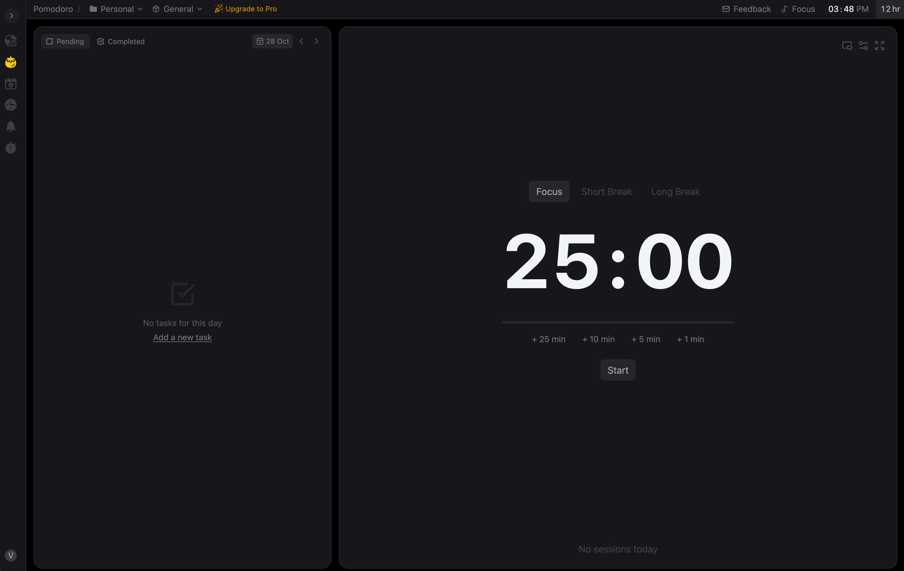

###### Pomodoro Timer  #######

A simple Pomodoro-style focus timer built with React + TypeScript and Tailwind. Includes a timer panel with focus/short/long sessions, persistent settings, keyboard shortcuts, a left icon rail (sidebar) and a local task list.

## Live demo
https://pomodorove.netlify.app/timer

## Features
- Focus / Short break / Long break sessions
- Start / Pause / Reset controls
- Quick add minutes (+25 / +10 / +5 / +1)
- Settings modal (durations, sessions until long break) persisted to localStorage
- Keyboard shortcuts: Space (start/pause), R (reset)
- Task list persisted to localStorage (add, optimistic UI, retry on failure)
- Route-based UI with Sidebar tabs (Timer, Tasks, Calendar, Notifications)

## Screenshot

Replace ./docs/screenshot.png with your actual screenshot. Optionally add multiple sizes or a GIF for demo.

## Tech
- React (FC + hooks)
- TypeScript
- Tailwind CSS
- react-router-dom
- react-icons

## Usage
- Open the app in the browser (usually http://localhost:3000).
- Use the Sidebar to switch between Timer and Tasks.
- In Timer:
  - Click Start / Pause / Reset or press Space / R.
  - Open Settings to change durations; settings persist across reloads.
- In Tasks:
  - Click "+ Add new task" to open the input, type a task and press Enter or click Add.
  - Tasks are saved to localStorage.

## Usage
- Use the Sidebar to switch between Timer and Tasks.
- In Timer:
  - Click Start / Pause / Reset or press Space / R.
  - Open Settings to change durations; settings persist across reloads.
- In Tasks:
  - Click "+ Add new task" to open the input, type a task and press Enter or click Add.
  - Tasks are saved to localStorage.

https://roadmap.sh/projects/pomodoro-timer